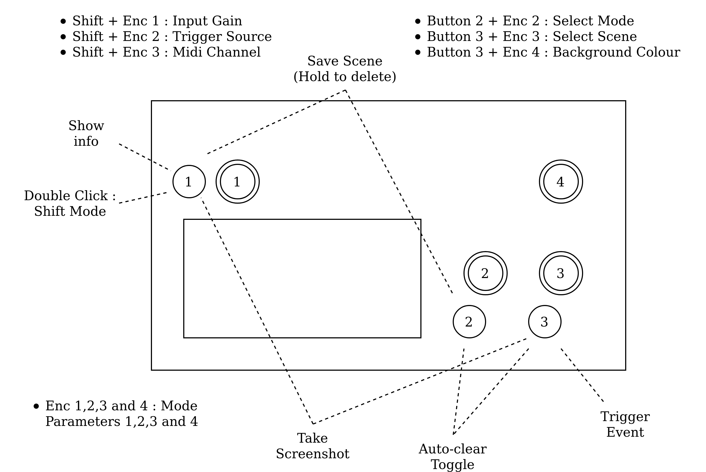

# EYESY_OS_fates

The operating system for the EYESY video synthesizer device - remixed.

Adaptation of the Critter&Guitari Eyesy video synth in order to run it on Fates (or norns shield) as a Sidekick App.
Eyesy Manual : https://www.critterandguitari.com/manual?m=EYESY_Manual#eyesy%E2%84%A2-user-manual

Support thread for this project : https://llllllll.co/t/critter-guitari-video-synth-eyesy-for-fates-working/38144

### Installation :

Please **be sure to have the latest Fates firmware** version installed (otherwise or you won't be able to run Eyesy and Norns in parallel)

```
 cd ~/sidekick/patches
 git clone https://github.com/Lcchy/Eyesy_for_fates Eyesy
 cd Eyesy
 ./deploy.sh
 ```
  
### Usage:
 - Connect a display to the first hdmi out
 - Boot up your Fates
 - Select Eyesy in Sidekick and control the video output via the hardware buttons
 - OR select Eyesy_Norns in Sidekick. This will launch norns with Eyesy in the background. 
   This time the knobs and buttons of your Fates will only interact with Norns. In order to control Eyesy you
   will have to use the TouchOSC Android (or iOS) app (see below).
   
### Control:

**Control via Fates hardware:**




**Control via TouchOSC:**
- Download and install the TouchOSC app for your iOS or Android device (it is not free, I've been looking for free/opensource alternatives, please let me know if you know one; nevertheless, this app is well developped and it's also nice to suppot this kind of effort I believe)
- Download the fitting TouchOSC template from [here](https://www.dropbox.com/sh/l5bhlr3li820olc/AAD399Ej1-16u7qgEB3BTCQ1a?dl=0) to your device and import it via the app (in Layout).
- In the OSC setting of the app set Host to the ip adress of your fates (your device and your Fates must be on the same network)
- Set the outgoing port to `4000` and ingoing to `4001`
- You're `Done`!
 
 
**Control via midi in messages (should be plug and play):**
  | Midi CC    | 21,22,23,24 | 25               | 26               | 27               | 28                | 29                | 30              | 31        | 32           | 33              | 34                         | 35       |
  |-------|-------------|------------------|----------------------|-------------------|---------------------|-----------|--------------|-----------------|----------------------------|----------|------------|----------------|
  | Control | Mode Params | Background Color | Scene selection | Save or delete (long hold) | Auto Clear Toggle | Mode Selection | Take Screenshot | Info Disp | Send Trigger | ShiftKey | Input Gain | Trigger Source |


### Web editor
The web editor lets you edit the pygame scripts that generate the visuals on the fly. It should be accessible at http://norns.local:8080/ (or IP:8080 where IP is the current ip adress of your Fates)

See the Eyesy manual for more details on using the web editor.

### Uninstall:
Simply run: `./uninstall.sh`

### Rem:
- If you don't connect the display before booting, Eyesy will launch on the fates display which is fun (but does not always work)
- If you have some letters flickering around on the screens and it disturbs you, you can edit `boot/cmdline.txt` by changing `fbcon=map:1` to `fbcon=map:2`. Note that this will deactivate the RaspberryPi boot and login text and you will therefore no longer be able to use it via a directly connnected screen and keyboard (only ssh will work).
- You can use the stereo input of fates in your Modes, there are accessible via `etc.audio_left` and `etc.audio_right` in the scripts, `etc.audio_in` remains L+R
- This project should work on any raspberryPi (controlling it via touchosc or midi) as long as your username is `we` and you install into a directory called `~/sidekick/patches`


### TODO:
- Make midi controls possible when running Norns
- Make the Open Frameworks engine work
